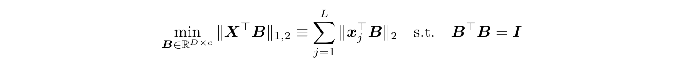
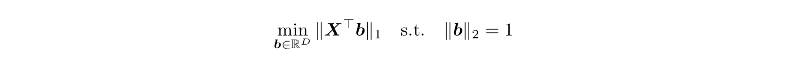

# A-Riemannian-SubGradient-Solver-for-Least-Absolute-Distance-Problem

This repository contains implementations (C++/Python/Matlab) of a Riemannian SubGraident (RSG) solver proposed in the NeurIPS 2019 paper "[A Linearly Convergent Method for Non-Smooth Non-Convex Optimization on the Grassmannian with Applications to Robust Subspace and Dictionary Learning](https://papers.nips.cc/paper/9141-a-linearly-convergent-method-for-non-smooth-non-convex-optimization-on-the-grassmannian-with-applications-to-robust-subspace-and-dictionary-learning)" for solving the least absolute distance problem with the following formulation:

where **_X_** is the data matrix with shape _D_ x _L_, and **_B_** is the variable whose columns are constrained to be orthonormal and ideally lie in a dual space which is orthogonal to the subspace spaned by the samples (columns of **_X_**).
In above formulations, we denote
- _D_ is the number of features, or number of dimensions in the feature space
- _L_ is the number of samples
- _c_ is the number of dual directions we aim to compute, and must satisfy 0 < _c_ < _D_

In particular, when _c_ is 1, the original problem becomes the following one on the sphere:

In this case, we are only interested in finding a single dual direction that is orthogonal to the samples as much as possible.


## C++ Users
The C++ version is implemented as a **header file** for ease of reuse, which is located in `./c++/RSG.h`. Note that the implementation relies on two external C++ scientific computing libraries, i.e., [Eigen](http://eigen.tuxfamily.org/index.php?title=Main_Page) and [libigl](https://libigl.github.io), to help with relevant numerical tasks. Since both of them are **header-only** libraries, we include them in the directory so that users do not need to spend extra effort downloading/installing them.

The code has been tested with g++ 4.2.1. For testing, run
~~~
cd c++/
g++ demo.cpp -std=c++11 -o demo
./demo
~~~
After running the demo, simple numerical results should be available in the standard output.


## Python Users
The Python version is implemented as a module, which is located in `./python/RSG.py`. 

The code has been tested with Python 3.7. For testing, run
~~~
cd python/
python demo.py
~~~


## Matlab Users
The Matlab version is implemented as multiple function files located in `./matlab/`.

The code has been tested with MATLAB_R2018b. For testing, open Matlab, change the working directory, and run `demo.m`.


## Synthetic Experiments
For interested users, we also include the code for synthetic experiments used in the paper, e.g., how do the various parameters affect the performance of the algorithm. See `./synthetic_experiments` for details.


## Citation
If you find the code or results useful, please cite the following paper:
```
@inproceedings{zhu2019linearly,
	title={A linearly convergent method for non-smooth non-convex optimization on the grassmannian with applications to robust subspace and dictionary learning},
	author={Zhu, Zhihui and Ding, Tianyu and Robinson, Daniel and Tsakiris, Manolis and Vidal, Ren{\'e}},
	booktitle={Advances in Neural Information Processing Systems},
	pages={9437--9447},
	year={2019}
}
```
